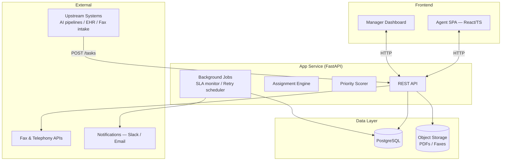
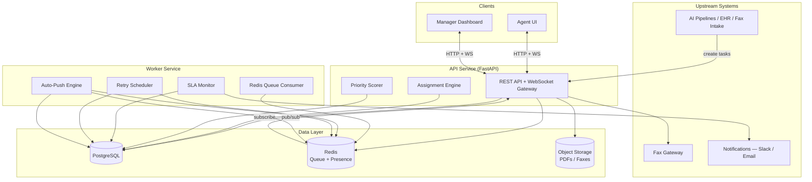
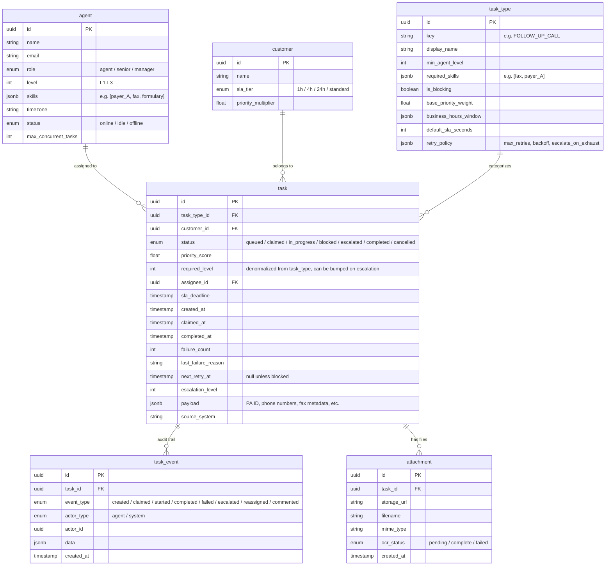
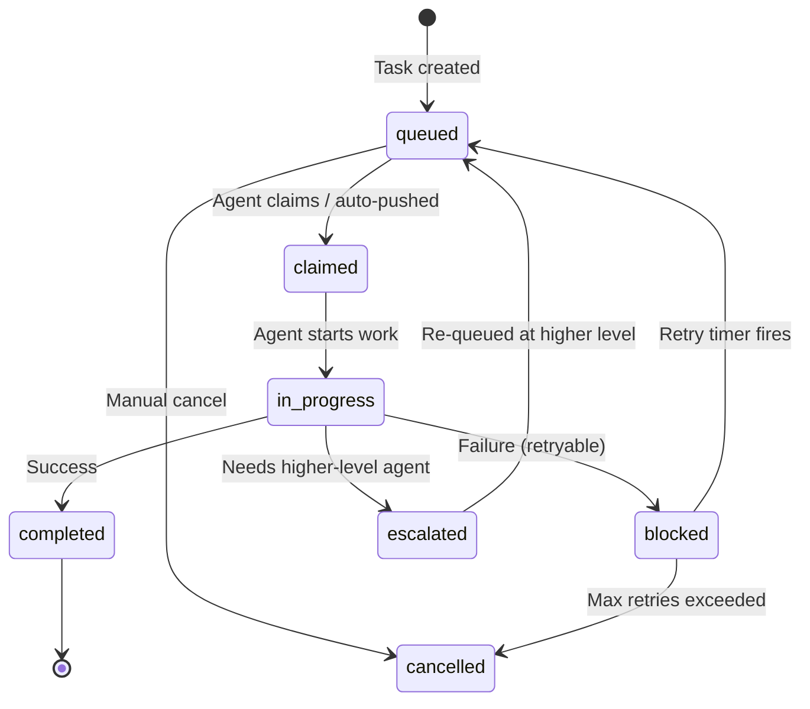

# Operations Task Management & Workflow System — Design

## Problem

Develop Health's AI automates most prior authorization work, but some tasks fall back to a human operations team (10–50 agents): follow-up calls, fax reviews, prescription transfers, data labeling, and quality reviews. These tasks vary in urgency, SLA requirements, skill requirements, and time sensitivity. Today there's no unified system to prioritize, route, and track this work.

**Goal:** Build an internal task management workbench that surfaces the right task to the right agent at the right time, with full auditability and manager visibility.

---

## Assumptions

- **Volume:** ~200–500 tasks/day across 10–50 concurrent agents. Single-digit requests/second — not a scaling problem.
- **Upstream integration:** AI pipelines, EHR connectors, and fax intake systems can POST tasks via REST API. We don't own those systems.
- **Concurrency:** Agents can hold multiple active tasks (configurable per agent, default 3). Typical workflow: one active task, others claimed and queued on their screen.
- **Identity:** Company SSO (OIDC) exists. We don't build auth, just integrate.
- **Single-step tasks:** Most tasks are atomic (claim → work → outcome). Multi-step orchestration (e.g., Temporal) deferred unless proven necessary.

---

## Architecture

**MVP ships as a single deployable app** (FastAPI) plus Postgres and object storage. Background jobs (SLA checks, retry scheduling) run as async tasks within the same process using a lightweight task runner (e.g., `arq` or APScheduler). When SLA pressure or team size justifies it, background workers extract into a separate service with Redis for presence and pub/sub — the code is already organized into modules with clean boundaries to make this split painless.



Later (Phase 2+), when real-time push is needed: add Redis for agent presence/heartbeat and WebSocket delivery, extract background jobs into a worker service.



| Component | Technology | Why |
|-----------|------------|-----|
| API | Python FastAPI | Async, typed, fast for internal CRUD. Matches likely ML stack. |
| Frontend | React + TypeScript | Mature ecosystem, component libraries (MUI) for fast internal-tool UI. |
| Database | PostgreSQL | Transactions, JSONB for flexible payloads, `FOR UPDATE SKIP LOCKED` for safe concurrent task claims. |
| Storage | S3-compatible | PDFs, fax images, call artifacts. |
| Auth | Company SSO (OIDC) | Existing identity provider. |
| Real-time (Phase 2) | Redis + WebSocket | Added when push assignments and live dashboards justify the complexity. |

---

## Data Model



**Key decisions:**
- **`task_type` is a DB table**, not an enum — managers add new types without code deploys.
- **`payload` is JSONB** — each task type stores its specific context (PA ID, phone numbers, fax metadata) without schema changes.
- **`task_event` is append-only** — full audit trail, never mutated. Supports compliance and debugging.
- **Separate `claimed` and `in_progress`** statuses — gives visibility into "assigned but not yet started" vs "actively working."

### Initial Task Types

Each of the seven task types from the requirements maps to a `task_type` row with specific configuration:

| Task Type | Key | Weight | Blocking | Min Level | Business Hours | Agent UX Notes |
|-----------|-----|--------|----------|-----------|----------------|----------------|
| Follow-up call | `FOLLOW_UP_CALL` | 50 | yes | L1 | 9am–5pm ET | Phone script, PA context panel |
| Prescription transfer call | `RX_TRANSFER_CALL` | 40 | yes | L1 | 9am–5pm ET | Pharmacy + Rx details in payload |
| Received fax review | `FAX_REVIEW` | 60 | yes | L1 | anytime | Inline fax/PDF viewer, OCR overlay |
| Send outbound fax | `OUTBOUND_FAX` | 70 | yes | L1 | anytime | PDF editor, fax number lookup, send action |
| Question set review | `QUESTION_SET_REVIEW` | 15 | no | L1 | anytime | Form-based Q&A validation UI |
| Internal Quality Review | `QUALITY_REVIEW` | 30 | no | L2 | anytime | Senior-only; links to original PA task |
| Generic data labeling | `DATA_LABELING` | 10 | no | L1 | anytime | Lowest priority — filler work |

**Formulary research** (looking up drug coverage rules for a specific payer) is not modeled as a standalone task type. In practice, an agent researches formulary information *during* a follow-up call or question set review — it's a substep, not an independently assignable unit of work. The relevant context (payer formulary links, drug tier, step therapy requirements) lives in the task's JSONB `payload`. If the business later finds agents spending significant standalone time on formulary lookup, adding a `FORMULARY_RESEARCH` task type is a config change, not a code change — that's the benefit of the extensible `task_type` table.

### Task Lifecycle



---

## API Contracts (key endpoints)

How upstream systems and the frontend interact with the backend:

| Endpoint | Method | Purpose | Caller |
|----------|--------|---------|--------|
| `/tasks` | POST | Create a task. Body: `{ task_type_key, customer_id, payload, sla_deadline? }`. Returns task with ID and computed priority. | Upstream systems |
| `/tasks/next` | POST | Atomically claim the highest-priority eligible task for the calling agent. Returns the full task with payload and attachments. | Agent frontend |
| `/tasks/{id}/outcome` | POST | Record outcome: `{ outcome: "completed" \| "failed" \| "escalated", reason?, notes? }`. Triggers retry/escalation logic server-side. | Agent frontend |
| `/tasks/{id}/attachments` | GET | Returns pre-signed S3 URLs (short TTL) for task attachments. | Agent frontend |
| `/tasks` | GET | Filterable list (by type, status, customer, assignee, age). Paginated. | Manager dashboard |
| `/tasks/{id}` | PATCH | Manager actions: reassign, boost priority, cancel. | Manager dashboard |
| `/dashboard/stats` | GET | Aggregated queue depth, SLA risk counts, agent workload, throughput. | Manager dashboard |
| `/task-types` | GET/PUT | List and update task type configuration (weights, retry policies, business hours). | Manager admin |

Upstream systems authenticate via API key; frontend uses SSO session tokens. All responses include standard error envelopes with correlation IDs for debugging.

---

## Prioritization Engine

A transparent, tunable scoring formula — all weights stored in DB tables, adjustable by managers without code deploys:

```
priority_score =
    task_type.base_priority_weight × customer.priority_multiplier
  + sla_urgency_bonus(time_remaining)
  + age_bonus(task_age)
  + business_hours_boost(task_type, current_time)
  + manager_override_bonus
```

| Factor | How it works |
|--------|-------------|
| **Base × customer** | Follow-up call (50) for 1h-SLA customer (3×) = 150. Generic labeling (10) for standard (1×) = 10. |
| **SLA urgency** | 0 when >80% time remains. Exponential ramp to +200 in final 20%. Breached tasks: +500. |
| **Age bonus** | `log2(age_minutes + 1) × 5` — sublinear so old low-priority tasks don't outrank fresh urgent ones. |
| **Business hours boost** | +100 for tasks that can *only* be done now (e.g., call at 4:30 PM, PBM closes at 5 PM). Tasks outside their window: excluded entirely. |
| **Manager override** | Optional flat bonus for manually boosted tasks. |

---

## Assignment: Hybrid Pull + Push

**Pull (default):** Agent clicks "Get Next Task." Backend atomically claims the highest-priority eligible task:

```sql
WITH candidate AS (
  SELECT t.id FROM tasks t
  JOIN task_types tt ON t.task_type_id = tt.id
  WHERE t.status = 'queued'
    AND t.required_level <= :agent_level
    AND tt.required_skills <@ :agent_skills   -- agent has all required skills
    AND in_business_hours(tt.business_hours_window, now())
  ORDER BY t.priority_score DESC, t.created_at ASC
  LIMIT 1
  FOR UPDATE OF t SKIP LOCKED
)
UPDATE tasks
SET status = 'claimed', assignee_id = :agent_id, claimed_at = now()
FROM candidate WHERE tasks.id = candidate.id
RETURNING tasks.*;
```

`SKIP LOCKED` ensures concurrent agents each get a distinct task without blocking. Key index: `CREATE INDEX idx_tasks_queue ON tasks (status, priority_score DESC) WHERE status = 'queued'`.

**Push (Phase 2 — urgent SLA protection):** When the system adds Redis and WebSockets, a background worker monitors tasks approaching SLA breach:
1. Find idle agents via Redis presence (agents heartbeat every 15s)
2. Select the **least-loaded** agent with matching skills/level
3. Deliver assignment via WebSocket; agent has 60s to accept, otherwise reassigned

This balances agent autonomy (pull) with SLA safety (push). **MVP alternative:** SLA-at-risk tasks are Slack-notified to managers who manually assign them.

### Failure & Retry Handling

When an agent marks a task as failed, they select a structured reason (e.g., "PBM phone line closed," "payer portal down," "illegible fax"). The `retry_policy` on `task_type` defines: `max_retries` (default 3), `backoff` ("fixed_1h", "next_business_day", "exponential"), and `escalate_on_exhaust` (boolean). If retries remain, the task moves to `blocked` with a `next_retry_at` computed from the backoff strategy. The Retry Scheduler in the Worker service picks up blocked tasks whose retry time has arrived and re-queues them. When max retries are exhausted: if `escalate_on_exhaust` is true, the task escalates (bumps `required_level`, re-queues for a senior agent); otherwise it's cancelled and flagged for manager review.

For task types like "Send outbound fax," the agent work screen provides an inline PDF viewer with basic annotation tools, a fax number lookup field (pre-populated from `payload`), and a "Send" action that calls the fax API. The outcome (sent/failed/wrong number) is captured as a structured event.

---

## Frontend

### Agent Work Screen (wireframe)

```
┌─────────────────────────────────────────────────────────────────────┐
│  [Logo]  Ops Workbench          My Tasks (3)    ●Online    J.Smith  │
├───────────────────────────────┬─────────────────────────────────────┤
│                               │                                     │
│  ┌─ Current Task ───────────┐ │  Context Panel                      │
│  │                          │ │  ┌─────────────────────────────┐    │
│  │  FOLLOW-UP CALL          │ │  │ PA #48291                   │    │
│  │  Customer: Acme Health   │ │  │ Patient: ███████████        │    │
│  │  SLA: 1h     23min left  │ │  │ Drug: Humira 40mg           │    │
│  │  Priority: ██████████ 92 │ │  │ Payer: Aetna                │    │
│  │                          │ │  │ Phone: (800) 555-0123       │    │
│  └──────────────────────────┘ │  │ Status: Pending review      │    │
│                               │  │ Last attempt: 3/12 — busy   │    │
│  Notes                        │  └─────────────────────────────┘    │
│  ┌──────────────────────────┐ │                                     │
│  │ Spoke with rep, PA is    │ │  Attachments                        │
│  │ under medical review...  │ │  ┌─────────────────────────────┐    │
│  │                          │ │  │ 📄 denial_letter.pdf        │    │
│  └──────────────────────────┘ │  │ 📄 clinical_notes.pdf       │    │
│                               │  └─────────────────────────────┘    │
│  ┌──────────┐ ┌────────────┐  │                                     │
│  │✓ Complete│ │✗ Failed ▾ │  │  History                            │
│  └──────────┘ └────────────┘  │  • 3/12 10:15 — Created (system)    │
│  ┌──────────┐ ┌────────────┐  │  • 3/12 14:30 — Attempted (Kim)     │
│  │↑ Escalate│ │⟳ Retry ▾  │  │  • 3/12 14:35 — Failed: line busy   │
│  └──────────┘ └────────────┘  │  • 3/13 09:00 — Claimed (J.Smith)   │
│                               │                                     │
│      [ ◀ Get Next Task ]      │                                     │
├───────────────────────────────┴─────────────────────────────────────┤
│  Queue: 47 tasks  │  Your active: 1/3  │  SLA at risk: 5            │
└─────────────────────────────────────────────────────────────────────┘
```

**Agent view — three screens:**
- **Work screen (above):** "Get Next Task" button (or auto-pushed task). Task detail with context panel (PA info, phone/fax numbers, attachments). Structured outcome buttons (complete / fail with reason / escalate). Notes field. Task history shows full audit trail.
- **My tasks:** List of claimed/in-progress/recently completed tasks.
- **Notifications:** WebSocket-powered alerts for pushed tasks and escalations.

### Manager Dashboard (wireframe)

```
┌─────────────────────────────────────────────────────────────────────┐
│  [Logo]  Ops Workbench — Manager          Dashboard  │  Tasks   │   │
├─────────────────────┬───────────────────┬───────────────────────────┤
│  Queued by Type     │  SLA Risk         │  Agent Status             │
│  ┌────────────────┐ │  ┌──────────────┐ │  ┌──────────────────────┐ │
│  │ Fax Review  18 │ │  │ 🔴 Breach  2 │ │  │ ● Kim L.    3 tasks  │ │
│  │ Follow-up  12  │ │  │ 🟡 <30min  5 │ │  │ ● J.Smith   1 task   │ │
│  │ Rx Transfer 8  │ │  │ 🟢 OK     40 │ │  │ ● M.Chen    2 tasks  │ │
│  │ Outbound Fax 5 │ │  └──────────────┘ │  │ ○ R.Patel   offline  │ │
│  │ Labeling     4 │ │                   │  └──────────────────────┘ │
│  └────────────────┘ │  Aging Buckets    │                           │
│                     │  ┌──────────────┐ │  Today                    │
│                     │  │ <30m    ████ │ │  ┌──────────────────────┐ │
│                     │  │ 30m-1h  ██   │ │  │ Completed: 84        │ │
│                     │  │ 1h-4h   █    │ │  │ Avg handle: 12min    │ │
│                     │  │ >4h     ▌    │ │  │ SLA met: 96%         │ │
│                     │  └──────────────┘ │  └──────────────────────┘ │
├─────────────────────┴───────────────────┴───────────────────────────┤
│  Task Table          [Filter: Type ▾] [Status ▾] [Customer ▾]       │
│  ┌────┬──────────────┬──────────┬────────┬──────┬────────┬────────┐ │
│  │ ID │ Type         │ Customer │ Status │ Age  │ Agent  │ Action │ │
│  ├────┼──────────────┼──────────┼────────┼──────┼────────┼────────┤ │
│  │ 84 │ Fax Review   │ Acme     │ queued │ 2h   │  —     │ Assign │ │
│  │ 79 │ Follow-up    │ BetaCo   │ in_prog│ 45m  │ Kim L. │ Reassn │ │
│  │ 71 │ Data Label   │ —        │ queued │ 3h   │  —     │ Boost  │ │
│  └────┴──────────────┴──────────┴────────┴──────┴────────┴────────┘ │
└─────────────────────────────────────────────────────────────────────┘
```

**Manager view:**
- **Dashboard (above):** Queued count by type and SLA tier. Aging buckets (0–30m, 30m–1h, 1–4h, >4h). SLA breach risk indicators. Agent online status and workload.
- **Task table:** Filterable by type, customer, status, assignee, age. Reassign, boost priority, cancel.
- **Agent overview:** Who's online, current workload, tasks completed today.

---

## Implementation Phases

| Phase | Scope | Timeline |
|-------|-------|----------|
| **1 — MVP** | Single deployable app. Task CRUD, pull-based assignment with SKIP LOCKED, simple scoring (base + SLA + age), agent work screen, manager task table, audit trail, SSO. Basic manager UI to edit task-type weights and retry policies (DB-backed, no code deploy). | Weeks 1–3 |
| **2 — Operational** | Business hours filtering, structured failure reasons + configurable retry/backoff, auto-escalation rules, SLA breach Slack alerts, attachment preview. Extract worker service + Redis when push assignments are needed. WebSocket delivery for urgent tasks. | Weeks 4–6 |
| **3 — Advanced** | Full manager admin panel (agent skill/level management, customer SLA config), agent load balancing in push, analytics (SLA perf, throughput, handling times), quality review sampling, predictive SLA alerts, observability (queue depth metrics, p95 handling times, alerting). | Weeks 7+ |

---

## Tradeoffs

| Decision | Chosen | Alternative | Rationale |
|----------|--------|-------------|-----------|
| Deployment | Monolith first, extract workers later | Separate services from day one | Faster to ship and operate with one deployable; code is modular so extraction is a deployment change, not a rewrite. |
| Task queue | Postgres SKIP LOCKED (MVP), add Redis later | Redis from day one | PG handles queueing fine at our volume; Redis earns its way in when we need presence tracking and pub/sub for push. |
| Assignment | Hybrid pull + push | Pull-only | Pull respects agent pace; push catches SLA risks. Best of both. |
| Task schema | JSONB payloads | Typed tables per task type | New task types without migrations. Validate at application layer. |
| Priority | Weighted formula with DB knobs | Hard priority lanes / ML | More nuanced than lanes, more transparent and debuggable than ML. Managers tune without eng support. |
| Real-time | WebSocket | Polling | Essential for push assignments and live dashboard. Minimal added complexity with FastAPI. |

**Compliance considerations:** Task data will contain PHI (patient names, prescriptions, insurance details). The design addresses this in layers, though a full HIPAA compliance review would be needed before production:

- **Encryption:** Data encrypted at rest (Postgres TDE / S3 SSE) and in transit (TLS everywhere).
- **Audit trail:** The append-only `task_event` table logs who accessed and modified each task, supporting HIPAA access logging — but it does not yet cover read-only access (e.g., an agent viewing a task without acting on it). Read-access logging should be scoped and added based on compliance review.
- **Access control:** Role-based access via SSO. Agents see only tasks assigned to them or available in their queue. Managers see aggregate views and task details for their team. Attachment URLs should be pre-signed with short TTLs, not permanent links.
- **Not yet addressed:** Data retention policies, PHI redaction in logs/error messages, and BAA requirements with infrastructure providers. These are operational/policy decisions that should be resolved with compliance counsel before launch.

---

*Design philosophy: ship a reliable queue + workbench fast, preserve clean seams for future workflow complexity, keep the priority engine transparent and manager-tunable.*
